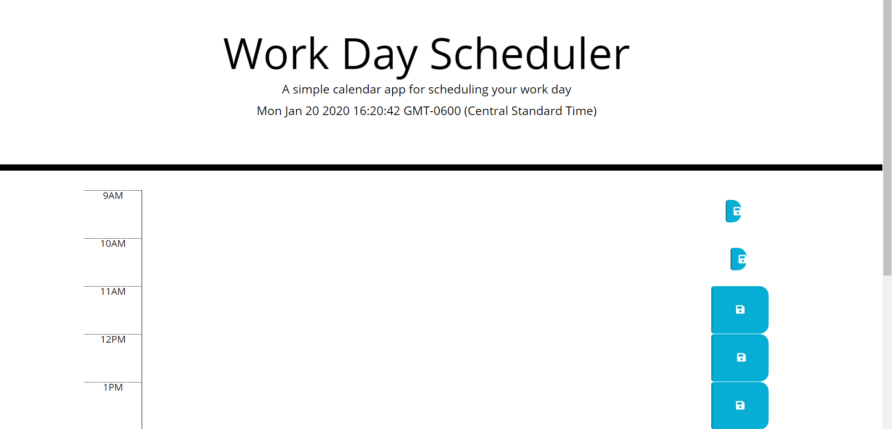

# Unit 05 Third-Party APIs Homework: Day Planner

Created a simple calendar application that allows the user to save events for each hour of the day. This app runs in the browser and features dynamically updated HTML and CSS powered by jQuery.

The app should display standard business hours (9 a.m. to 5 p.m.). Each time slot should represent one hour and contain the following:

* The time

* A field to hold user input

* A save button

Clicking on the save button will store the time and user input in `localStorage`.

Near the top of the calendar, the application should display the current day. Additionally, each hour should be color coded to reflect whether the time slot is in the past, the present, or the future. This will change depending on the time of day.

 Used the [Moment.js](https://momentjs.com/) library to work with date and time.



## User Story

AS AN employee with a busy schedule

I WANT to add important events to a daily planner

SO THAT I can manage my time effectively 

## Business Context

Poor time management can result in missed meetings and deadlines or create the appearance of unprofessionalism. A daily planner allows employees to see their day at a glance, schedule time effectively, and improve productivity. 

## Minimum Requirements

* Functional, deployed application.

* GitHub repository with a unique name and a README describing project.

* The application displays timeblocks for standard business hours (9 a.m. to 5 p.m.).

* Each timeblock contains an input field and save button.

* Clicking a timeblock's "Save" button stores the input text in local storage, allowing the text to persist when the application is refreshed.

* The current day is displayed at the top of the calendar.

* Each timeblock is color coded to indicate whether it is in a past, present, or future hour.

```
GIVEN that an employee adds events to a specific hour in a calendar

WHEN the employee clicks the save button

THEN events are saved in the timeblock for that hour
```
- - -

Website Link: https://didier-d-crypto.github.io/Homework-05/